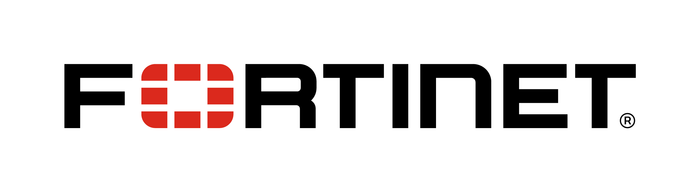

# Contributors
- Markus Rest ([@xamafe](https://github.com/xamafe)) (Leader)
- Julian Petersohn ([@randomstring](https://github.com/randomstring)) (Leader)
- Waseem Ajrab ([@default-eshu](https://github.com/default-eshu))

# Supporters
Thank you to all our supporters and sponsors for their help and support to allow us to continue our work on the project.

  <table style="border: none; display: inline-block;">
    <tr>
      <td style="border: none; padding: 10px;">
        
      </td>
      <td style="border: none; padding: 10px;">
        
      </td>
      <td style="border: none; padding: 10px;">
        
      </td>
    </tr>
  </table>

